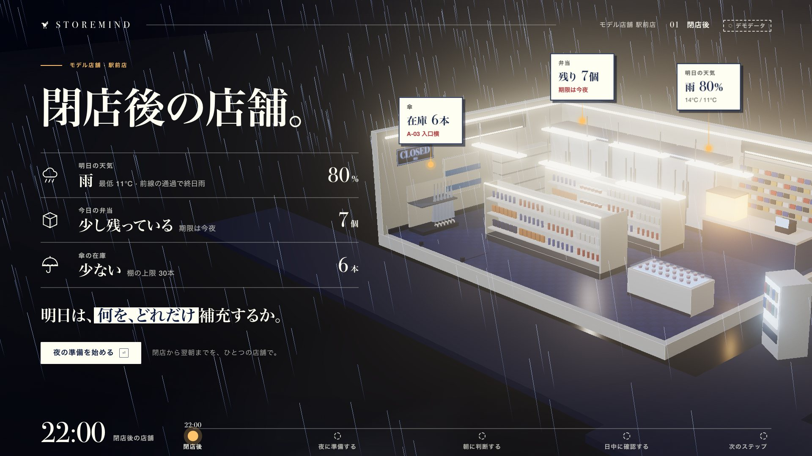
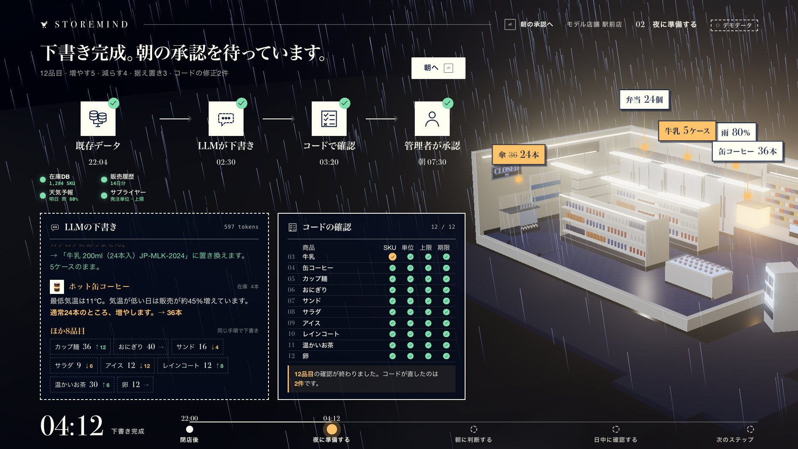
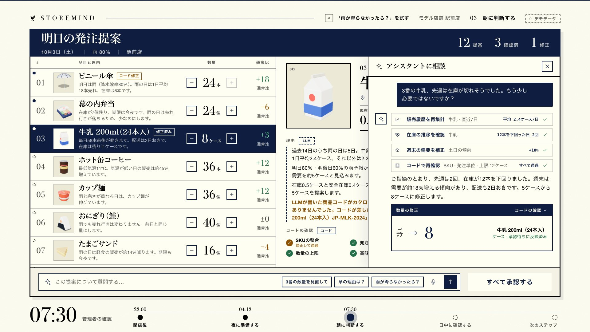
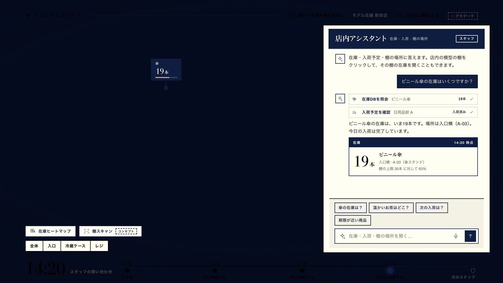
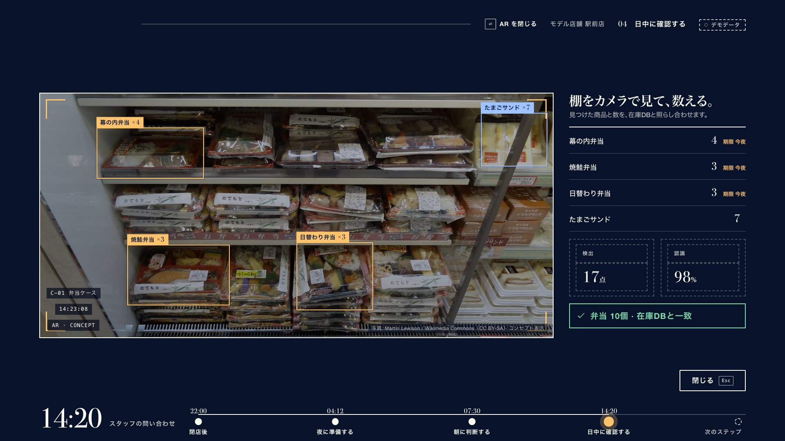
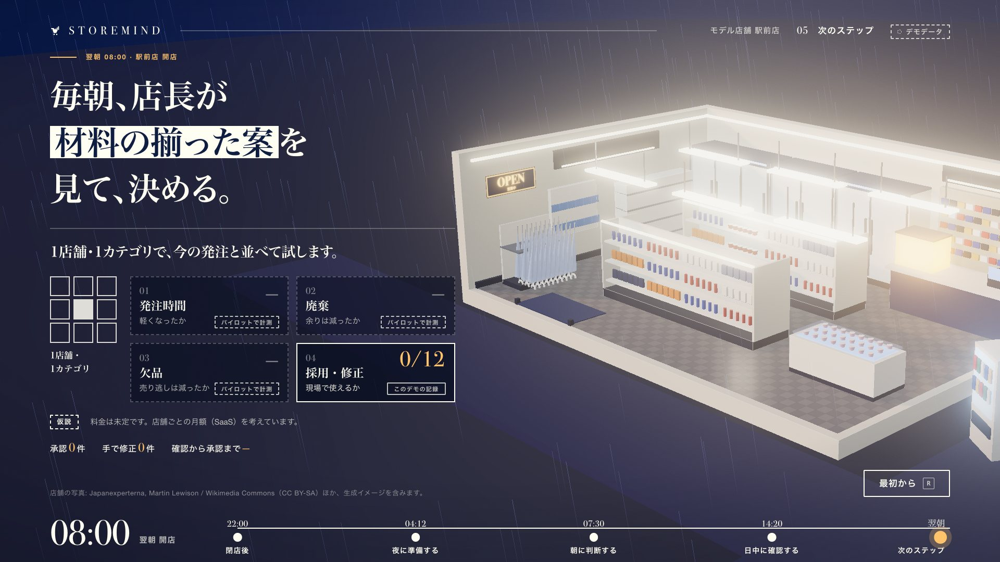

# StoreMind Showcase

An offline concept demo for the StoreMind presentation: **one store, from closing tonight to opening tomorrow.** A cut-away 3D convenience store, a night run where an LLM drafts and code checks, a morning approval sheet you can talk to, a daytime staff assistant that answers on the model, and the pilot.

All LLM behaviour is scripted mock data. No network, no build step, no accounts.



## Run

```bash
cd showcase
./run-demo.command        # or: python3 serve.py          → http://localhost:8080
```

No Python? Open **`offline.html`** (single-script build, works from `file://`). Rebuild it after edits with `tools/build-offline.sh`.

Press **?** in the demo for shortcuts, **P** for speaker notes, **A** to autoplay the whole film (~2 min), **F** for full screen.

| | |
|---|---|
| Presenter guide | [`docs/RUNBOOK.md`](docs/RUNBOOK.md) |
| Design vision, tokens, motion | [`docs/DESIGN-VISION.md`](docs/DESIGN-VISION.md) |
| Handoff for implementation agents | [`docs/HANDOFF.md`](docs/HANDOFF.md) |
| Data and chat event contract | [`docs/MOCK-CONTRACT.md`](docs/MOCK-CONTRACT.md) |

## Scenes

| 01 閉店後 | 02 夜に準備する |
|---|---|
|  |  |
| **03 朝に判断する** | **04 日中に確認する** |
|  |  |
| **04b 棚スキャン（コンセプト）** | **05 次のステップ** |
|  |  |

## Verify

```bash
node tools/smoke.mjs       # plays the whole story in headless Chrome, asserts it, rewrites docs/screens/
```

## Related, untouched

`mobile/` (Flutter app), `src/` (.NET service), `storemind-flutter-web/` (previous web build). This folder does not depend on them.

## Credits

Three.js (MIT), GSAP (standard free licence), Bodoni Moda (OFL). Shelf photograph in the AR concept: Japanexperterna / Martin Lewison, Wikimedia Commons (CC BY-SA). Palette and typography follow the StoreMind deck.
